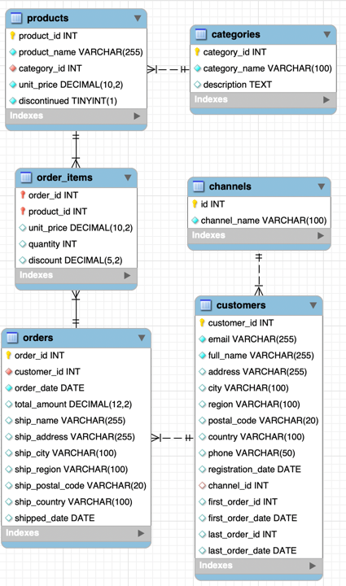

# 📊 Customer Behavior Analysis using SQL

<p align="center">


</p>

---

## 📌 Project Overview

**Customer Behavior Analysis** is an end-to-end SQL portfolio project that analyzes the complete customer lifecycle of an e-commerce business using relational data.

The project focuses on answering **30 real-world business questions** related to customer acquisition, conversion, retention, and churn while demonstrating practical SQL skills used in the industry.

---

## 🎯 Business Objectives

- 📈 Analyze customer acquisition trends
- 💰 Measure customer conversion rates
- 🛍️ Understand purchasing behavior
- 🔄 Analyze customer retention
- 📉 Identify churned customers
- 📊 Generate business insights using SQL

---

# 🔄 Customer Lifecycle

```text
                 Customer Lifecycle

        Website Visitor
               │
               ▼
      Customer Registration
               │
               ▼
        First Purchase
               │
               ▼
      Repeat Purchases
               │
               ▼
      Customer Retention
               │
               ▼
         Customer Churn
```

---

# 🗄️ Database Schema

The project contains six relational tables.

| Table | Description |
|--------|-------------|
| Customers | Customer information and registration details |
| Orders | Customer orders |
| Order_Items | Products purchased in each order |
| Products | Product details |
| Categories | Product categories |
| Channels | Customer acquisition channels |

---

# 🖼️ Data Model

> Add your ER Diagram here.

```md
<p align="center">
    
</p>
```

---

# 🛠️ Tech Stack

<p align="center">


</p>

| Technology | Purpose |
|------------|---------|
| MySQL 8.0 | Database |
| SQL | Data Analysis |
| MySQL Workbench | Query Execution |
| Git | Version Control |
| GitHub | Project Hosting |

---

# 📂 Project Structure

```text
CUSTOMER_BEHAVIOR_ANALYSIS_SQL/
│
├── Data/
│   ├── CLEANED/
│   └── RAW/
│
├── DOCS/
│   ├── Data_Model.png
│   ├── EER_Diagram.mwb
│   ├── Project_Customer_Behavior_Analysis.pdf
│   └── Schema_Explanation.md
│
├── SQL/
│   ├── 01_create_database.sql
│   ├── 02_create_tables.sql
│   ├── 03_load_data.sql
│   ├── 04_data_validation.sql
│   └── 05_questions.sql
│
├── RESULTS/
│   ├── SQL_Solutions.md
│   └── Screenshots/
│
├── README.md
├── LICENSE
└── .gitignore
```

---

# 📊 Business Analysis

The project is divided into five major business areas.

| Analysis Area | Status |
|---------------|:------:|
| Customer Acquisition | ✅ |
| Customer Conversion | ✅ |
| Customer Activity | ✅ |
| Customer Retention | ✅ |
| Customer Churn | ✅ |

---

# 📚 SQL Concepts Covered

### Basic SQL

- SELECT
- WHERE
- ORDER BY
- GROUP BY
- HAVING
- LIMIT

### Intermediate SQL

- INNER JOIN
- LEFT JOIN
- Aggregate Functions
- CASE Statements
- Date Functions
- Subqueries

### Advanced SQL

- Common Table Expressions (CTEs)
- Window Functions
- Ranking Functions
- Business KPI Calculations
- Customer Analytics

---

# ⚙️ Project Workflow

```text
                    CSV Files
                        │
                        ▼
              Create Database
                        │
                        ▼
               Create Tables
                        │
                        ▼
                 Import Data
                        │
                        ▼
               Validate Data
                        │
                        ▼
         Solve 30 SQL Business Questions
                        │
                        ▼
          Generate Business Insights
```

---

# 📁 SQL Files

| File | Description |
|------|-------------|
| 01_create_database.sql | Creates the project database |
| 02_create_tables.sql | Creates all tables |
| 03_load_data.sql | Loads CSV files into MySQL |
| 04_data_validation.sql | Validates imported data |
| 05_questions.sql | Contains all 30 SQL questions and solutions |

---

# 📸 Results

Each business question includes:

- 📄 Business Question
- 💻 SQL Query
- 📷 Output Screenshot

```text
RESULTS/
│
├── SQL_Solutions.md
└── Screenshots/
    ├── Q01.png
    ├── Q02.png
    ├── ...
    └── Q30.png
```

---

# 🎓 Learning Outcomes

By completing this project, you will gain hands-on experience in:

- Customer Analytics
- Marketing Analytics
- Customer Segmentation
- Customer Conversion Analysis
- Customer Retention Analysis
- Churn Analysis
- SQL Query Writing
- SQL Query Optimization
- Business KPI Reporting
- Relational Database Design

---

# 🚀 Future Improvements

- Build interactive dashboards using Power BI.
- Create customer segmentation reports.
- Develop SQL stored procedures and views.
- Perform advanced customer cohort analysis.

---

# 👨‍💻 Author

**Onkar Jadhav**

Aspiring Data Engineer

- 💼 **LinkedIn:** https://www.linkedin.com/in/onkar-jadhav-oj0629/
- 💻 **GitHub:** https://github.com/onkar0629

---

## ⭐ Support

If you found this project useful, consider giving it a ⭐ on GitHub!